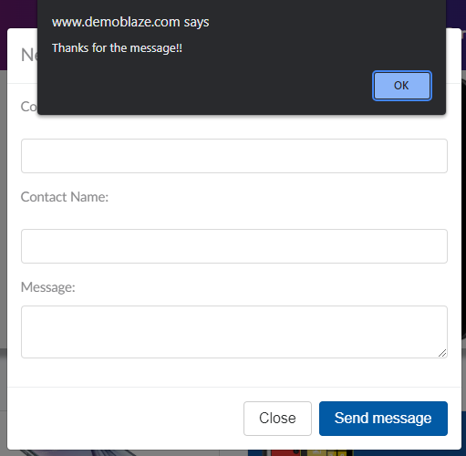

# Bugs
Below are some Bug samples that I wrote

## Product store doesn’t have a quantity field for products

**Priority & Severity**

P3 – Normal

**Description**

When we add more products from the same product to the cart there is no quantity field for them. This generates a long list of products.

**Steps to reproduce**
1. Go to https://www.demoblaze.com/index.html  
2. Sing up to the site
3. Log in to the site
4. Add the same product several times
5. Press the ,,Cart” button
6. Look at the product

**Expected result**

The product should have a quantity field with a unit of measure.

**Actual result**

The product doesn’t have a quantity field.
### Bug Image

-----------------

## Contact Section is working without input fields being completed

**Priority & Severity**
P4 – low

**Description**
When we try the contact page, we can press send message without filling in the necessary fields

**Steps to reproduce**
1. Go to https://www.demoblaze.com/index.html  
2. Sing up to the site
3. Log in to the site
4. Acces the Contact page
5. Press "Send message" button
6. You will get the confirmatin "Thanks for the message"

**Expected result**

The fields "Contact Email", "Contact Name" and "Message" should be completed in order to send a message

**Actual result**

The fields "Contact Email", "Contact Name" and "Message" do not have to be completed in order to send a message

### Bug Image

-----------------

## No currency symbol for products

**Priority & Severity**

P3 – Low

**Description**

Products don’t have a currency symbol in the price area on the website.

**Steps to reproduce**

1. Go to https://juice-shop.herokuapp.com/#/
2. Look in the price area for products

**Expected result**

There should be a currency symbol in the price area.

**Actual result**

There is no currency symbol in the price area.

### Bug Image

 

-----------------

## Products name do not change after changing the language

**Priority & Severity**
P3 – Low

**Description**
After changing the website display language, the products name reamin on the english language

**Steps to reproduce**

1. Go to https://juice-shop.herokuapp.com/#/
2. Change the display language
3. Look at the name of products

**Expected result**
The product name should change based on the selected language

**Actual result**
The product name remain on the english language when selecting another display language

### Bug Image
 

-----------------

## Wrong video in ,,About Us" section on demoblaze.com store 

**Priority & Severity**

P4 – low

**Description**

In „About Us” section is a video that doesn’t describe the store. A course in IT is described in the video. 

**Steps to reproduce**
1. Go to http://www.demoblaze.com/index.html 
2. Click on the section ,,About Us”
3. Click on the video

**Expected result**

The video should describe the store.

**Actual result**

The video describe a course in it. 

### Bug Image

 

-----------------

## Order only with the name and number of the card
**Priority & Severity**

P1 – High

**Description**

You can place an order without going through all the necessary information. In order form you can complete just the name and number of the card and to press  „Order” button.

**Steps to reproduce**
1. Go to https://www.demoblaze.com/index.html  
2. Sing up to the site
3. Log in to the site
4. Add a product to the cart
5. Press the ,,Cart” button
6. Press the ,,Place order” button
7. Fill in ,,Name” and ,,Credit card”  fields
8. Press ,,Order” button

**Expected result**

You will not be able to order.

**Actual result**

The order is placed.

 

 

-----------------

